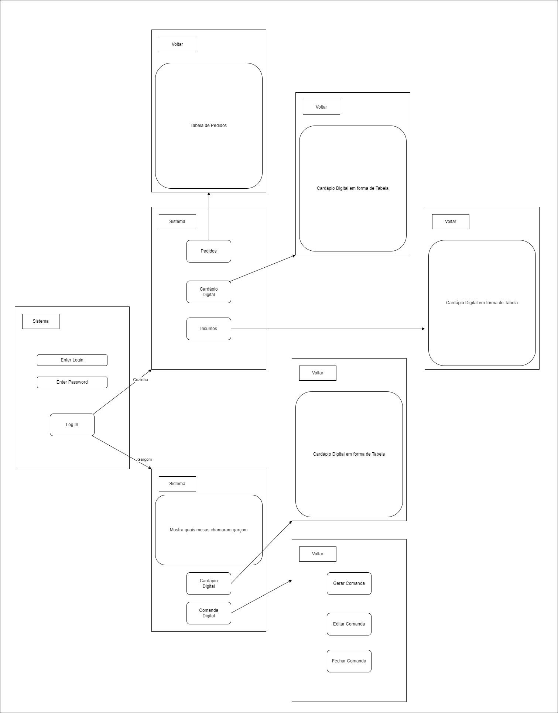
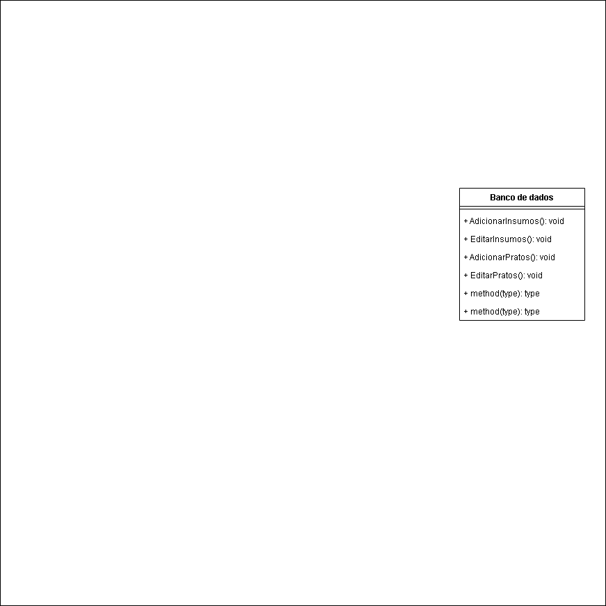

# Sistema Gerenciamento de um Boteco

## Índice
- [Informações Gerais](#informações-gerais)
- [Reuniões](#reuniões)
- [Documentação](#documentação)

## Informações Gerais

### Grupo
- Douglas Candido Domiciano

### Cliente
- Amigo estudandte de gastronomia

### Tema
Um sistema de manejamento do estoque, cardapio, pedidos e atendimento de um Boteco.

## Reuniões
1º - 21/09/2024
2º - 05/10/2024
3º - 19/10/2024
4º -

## Documentação

### Requisitos

| ID |  Requisito   |   Forma de medição e critério de satisfação   |   Requisitos Relacionados  |   Importancia   |
|----|--------------|-----------------------------------------------|----------------------------|-----------------|
| R1 |  GERENCIAR OS INSUMOS    |   Deve existir um banco de dados onde são catalogados os insumos. |   #   |   Alta    |
| R1.1 | CRUD DOS INSUMOS    |  Usuarios devem poder adicionar, ver, atualizar e remover insumos dos bancos de dados.   |   R1   |   Alta    |
| R2 |  CARDAPIO DIGITAL   |    Um cardapio  digital que mostra todas as opições de compra com preço e descrição.    |   #   |   Alta    |
| R3 |  COMANDA DIGITAL    |    Pode gerar e dividir comandas e alocar os pedidos para diferentes comandas.  |   #   |   Alta    |
| R4 |  CHAMAR GARÇOM    |  Botao que imediatamente notifica o garcom mais proximo. |   #   |   Alta    |

#### Legenda:
- **Importancia:**
  - Alta: Requisitos essenciais para o funcionamento básico do sistema ou que agregam alto valor ao usuário.
  - Média: Requisitos importantes, mas que podem ser implementados em fases posteriores ou têm menor impacto imediato.

### Diagramas

#### Diagrama de Caso de Uso

#### Descrição Textual dos Casos de uso

| **ID**  | **Caso de Uso**              | **Ator Principal** | **Resumo**                                                                                                                | **Fluxo Principal**                                                                                                                                                                                                                          |
|--------|-----------------------------|--------------------|--------------------------------------------------------------------------------------------------------------------------|---------------------------------------------------------------------------------------------------------------------------------------------------------------------------------------------------------------------------------------------|
| C1     | Gerenciar Insumos            | Chefe              | Gerencia os insumos no banco de dados, permitindo adicionar, visualizar, atualizar e remover insumos.                     | 1. Chefe acessa o gerenciamento de insumos. 2. Escolhe adicionar, ver, atualizar ou remover insumos. 3. Sistema atualiza o banco de dados. 4. Sistema confirma a operação.                                                         |
| C1.1   | CRUD dos Insumos             | Chefe              | Realiza operações de CRUD nos insumos cadastrados no sistema.                                                             | 1. Chefe acessa o menu CRUD de insumos. 2. Seleciona criar, ler, atualizar ou excluir. 3. Insere ou edita as informações dos insumos. 4. Sistema atualiza o banco de dados.                                                        |
| C2     | Cardápio Digital             | Chefe, Garçom      | Chefe gerencia itens do cardápio; garçom acessa o cardápio digital para registrar os pedidos dos clientes.                | 1. Chefe acessa o cardápio e edita itens. 2. Garçom acessa o cardápio digital durante o atendimento. 3. Garçom registra o pedido com base nas opções do cardápio.                                                                       |
| C3     | Comanda Digital              | Garçom             | Cria, divide e aloca pedidos nas comandas de cada mesa. Chefe acompanha o status das comandas em tempo real.              | 1. Garçom seleciona a mesa e cria uma comanda digital. 2. Registra os pedidos na comanda. 3. Garçom divide a comanda, se necessário. 4. Sistema associa pedidos às comandas. 5. Chefe visualiza status das comandas.             |
| C4     | Chamar Garçom                | Cliente (indireto), Garçom | Clientes chamam o garçom via um botão, e o sistema notifica o garçom mais próximo.                                       | 1. Cliente aperta o botão "Chamar Garçom". 2. Sistema notifica o garçom mais próximo. 3. Garçom recebe a notificação e atende à mesa correspondente.                                                                                  |
| C5     | Gerenciar Mesas              | Chefe, Garçom      | Chefe define a disposição das mesas; garçom associa comandas e acompanha o status das mesas.                              | 1. Chefe configura mesas no sistema. 2. Garçom acessa o mapa de mesas e associa comandas. 3. Sistema atualiza o status da mesa automaticamente.                                                                                        |
| C6     | Gerar Relatórios de Vendas e Estoque | Chefe          | Gera relatórios sobre vendas e níveis de estoque dos insumos.                                                            | 1. Chefe acessa interface de relatórios. 2. Seleciona o tipo de relatório (vendas, estoque). 3. Sistema gera o relatório com base nos dados e apresenta ao chefe.                                                                      |

---

Esta tabela organiza os casos de uso de forma mais visual e estruturada, facilitando a compreensão das interações entre os atores e o sistema.

#### Diagrama de Classes

#### Mapa de Navegação

#### Modelo Conceitual
